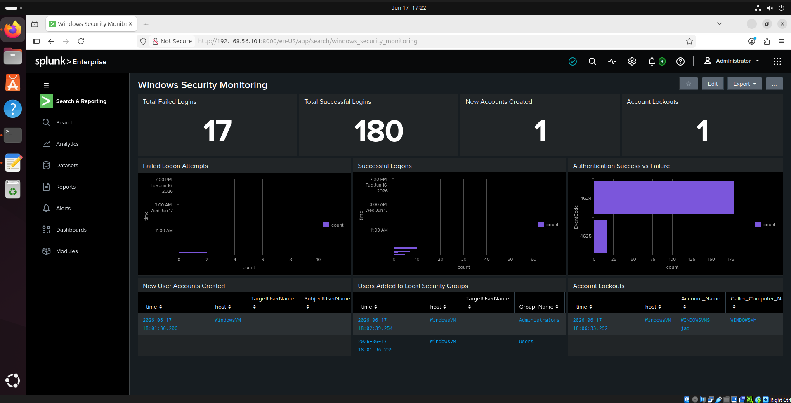
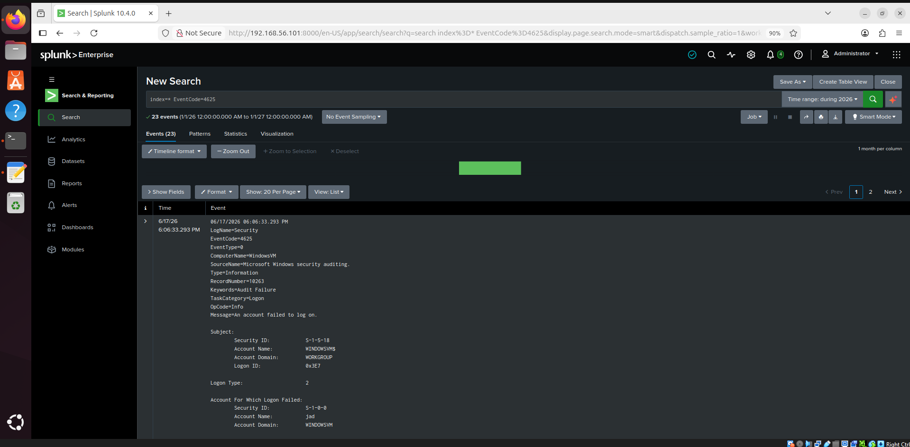
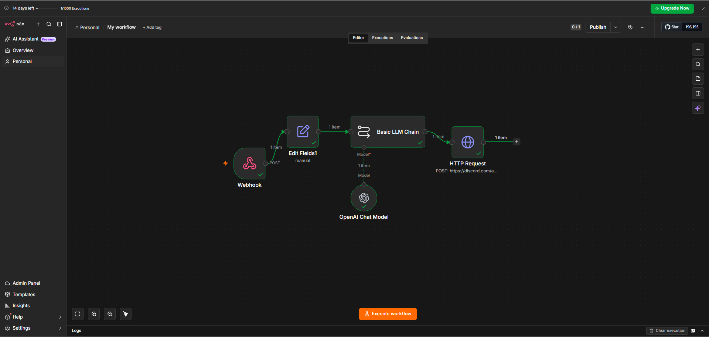
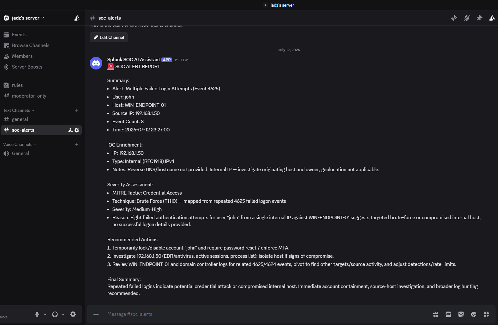

# Splunk SOC Monitoring Lab with AI Assistant

## Overview

This project is a SOC-focused security monitoring lab built with Splunk Enterprise, Windows Security Logs, and an AI-assisted alert triage workflow using n8n.

The lab collects and analyzes Windows security events such as failed logons, successful logons, account creation, group changes, and account lockouts. It also includes an AI-assisted workflow that receives alert data through n8n, generates a structured SOC triage report, and sends the report to a Discord SOC alert channel.

The goal of this project is to simulate how a junior SOC analyst can monitor alerts, investigate suspicious activity, document findings, and use automation to improve alert triage and reporting.

## Objectives

- Deploy Splunk Enterprise on Ubuntu
- Configure Splunk Universal Forwarder on a Windows endpoint
- Ingest Windows Security Event Logs into Splunk
- Create dashboards for authentication and account activity
- Investigate Windows security events using SPL
- Map detections to MITRE ATT&CK techniques
- Build an n8n workflow for AI-assisted SOC alert triage
- Send AI-generated SOC reports to a Discord alert channel

## Architecture

```text
Windows Endpoint
    ↓
Splunk Universal Forwarder
    ↓
Splunk Enterprise on Ubuntu
    ↓
Splunk Dashboard and Saved Searches
    ↓
n8n Webhook
    ↓
AI SOC Triage Report
    ↓
Discord SOC Alert Channel
```

See `docs/architecture.md` for more details.

## Technologies Used

- Splunk Enterprise
- Splunk Universal Forwarder
- Ubuntu Linux
- Windows 10
- Windows Security Event Logs
- SPL
- n8n
- AI-assisted workflow
- Discord Webhook
- MITRE ATT&CK

## Dashboard Features

- Failed Logon Monitoring — Event ID 4625
- Successful Logon Monitoring — Event ID 4624
- Authentication Success vs Failure Comparison
- New User Account Creation Detection — Event ID 4720
- User Added to Security Group Detection — Event ID 4732
- Account Lockout Monitoring — Event ID 4740

## SOC AI Assistant Upgrade

This project was upgraded with a SOC AI Assistant workflow using n8n.

The workflow demonstrates how Splunk alert data can be sent to an n8n webhook, processed by an AI model, and delivered to a Discord SOC alert channel as a structured triage report.

The AI-generated report includes:

- Alert summary
- IOC details
- Severity assessment
- MITRE ATT&CK mapping
- Recommended actions
- Escalation guidance

This was built as a lab proof-of-concept to show how AI-assisted automation can support SOC analysts with faster alert review and documentation.

See `docs/soc-ai-assistant-workflow.md` for the full workflow explanation.

## Windows Event IDs Monitored

| Event ID | Description |
|---|---|
| 4624 | Successful logon |
| 4625 | Failed logon |
| 4720 | New user account created |
| 4732 | User added to local security group |
| 4740 | Account lockout |

## MITRE ATT&CK Mapping

| Event | MITRE Technique |
|---|---|
| Failed logons | T1110 - Brute Force |
| Successful logons | T1078 - Valid Accounts |
| New user account creation | T1136 - Create Account |
| User added to security group | T1098 - Account Manipulation |
| Account lockouts | T1110 - Brute Force |

## Screenshots

### Splunk Dashboard Overview



### Failed Login Investigation



### n8n SOC AI Assistant Workflow



### Webhook Alert Data


### AI-Generated SOC Report


### Discord SOC Alert Report



## Skills Demonstrated

- SIEM deployment and administration
- Windows Security Log analysis
- SPL query development
- Security monitoring dashboard creation
- Alert triage
- Failed login investigation
- Account activity monitoring
- MITRE ATT&CK mapping
- SOC-style reporting
- Workflow automation with n8n
- AI-assisted alert documentation
- Discord webhook alerting

## Important Note

This project was built in a personal lab environment for learning and portfolio purposes. The AI assistant is designed to support alert triage and documentation, but it does not replace human analyst judgment.

Sensitive data such as API keys, webhook URLs, passwords, and private credentials are not included in this repository.

## Lessons Learned

This project provided practical experience with Splunk deployment, Windows event monitoring, dashboard creation, alert investigation, and SOC documentation.

The AI assistant upgrade also showed how automation can support SOC workflows by helping analysts summarize alerts, map events to MITRE ATT&CK, assess severity, and send reports to a communication channel.
